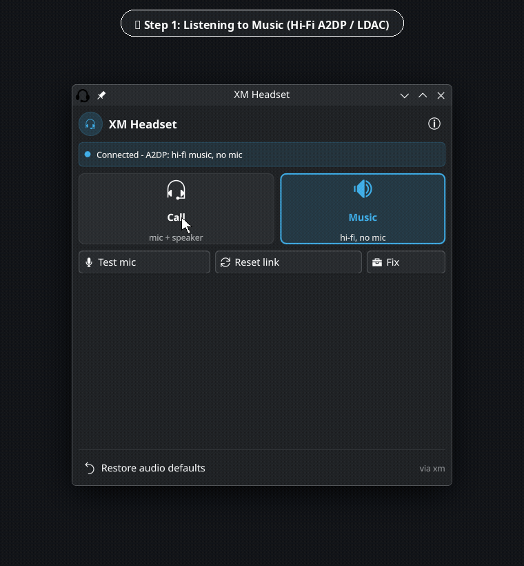
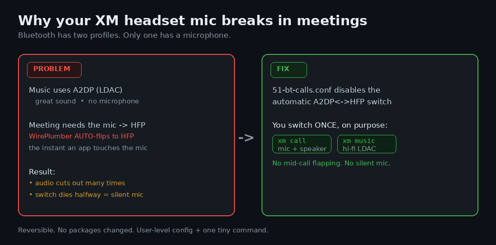
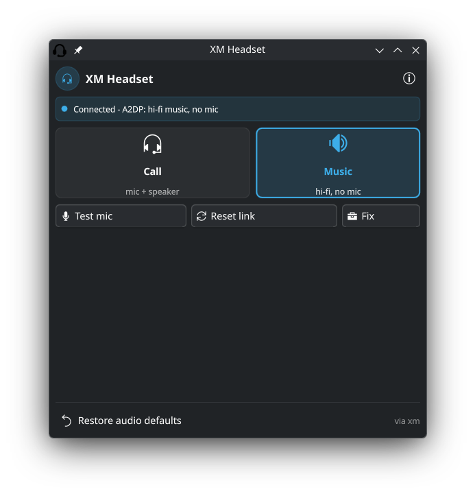
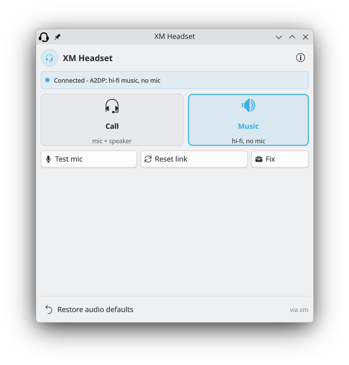

<div align="center">

# 🎧 xm

### Stop your Sony XM headset from losing its microphone in meetings

**Choose your workflow: one click in your KDE Plasma panel, or one fast terminal command.**

*PipeWire Bluetooth Profile Manager & Native KDE Plasma 6 Widget for Sony WH/WF-1000XM headsets*

<p align="center">
  
  
  
  
  
</p>

<p align="center">
  
</p>

<p><em>One-click profile switching, real-time status monitoring, quick mic diagnostic self-test, and full Breeze Light & Dark theme support.</em></p>

</div>

---

## 📑 Table of Contents

- [The Problem & The Fix](#-the-problem--the-fix)
- [Choose Your Workflow](#-choose-your-workflow)
  - [Option 1: KDE Plasma 6 Widget (GUI)](#-option-1-kde-plasma-6-widget)
  - [Option 2: Terminal CLI (`xm`)](#-option-2-terminal-cli-xm)
- [How to Add to Panel & Desktop](#-how-to-add-to-panel--desktop)
- [Installation Guide](#-installation-guide)
- [Troubleshooting & FAQ](#-troubleshooting--faq)
- [Clean Uninstall & Safe Rollback](#-clean-uninstall--safe-rollback)
- [Design Principles](#-design-principles)

---

## 😤 The Problem & 💡 The Fix

### The Problem

Your headphones sound **incredible** for music. Then you join a Zoom or Microsoft Teams meeting and everything breaks:
- The microphone cuts out mid-sentence.
- The audio stutters or drops into muffled mono.
- Colleagues say *"you're completely silent"* while Bluetooth settings claim you are connected.

> *"Why does my Sony WH-1000XM5 lose its microphone in Teams but work perfectly in Spotify?"*

Bluetooth headsets have two distinct audio profiles, and only one includes a microphone:

<p align="center">
  
</p>

| Profile | Primary Use | Speaker Audio | Microphone | Quality |
|:---|:---|:---:|:---:|:---|
| **A2DP** | Music / Media Playback | ✅ | ❌ | Hi-Fi (LDAC / AAC / aptX) |
| **HFP / HSP** | Voice Calls / Meetings | ✅ | ✅ | Voice-Grade (mSBC wideband) |

By default, Linux **WirePlumber flips between A2DP and HFP automatically** the split-second any application peeks at your microphone. On Sony XM headsets, this flapping causes connection dropouts and can stall the Bluetooth SCO link halfway, leaving a silent microphone.

### The Fix

Two tiny, fully-reversible pieces:

1. **`51-bt-calls.conf`**: A WirePlumber drop-in configuration that **disables automatic profile flapping** and locks in mSBC wideband speech + hardware volume control.
2. **`xm` & KDE Widget**: Lets **you** decide when to flip profiles—either via one click on your panel or one terminal command.

No kernel patches. No background daemons. 100% reversible.

---

## 🎬 Choose Your Workflow

Whether you prefer a native desktop applet or a rapid terminal command, `xm` provides identical single-flight control over your PipeWire audio stack.

---

### 🖥️ Option 1: KDE Plasma 6 Widget

A native Plasma 6 desktop applet that brings one-click audio profile control directly to your panel or desktop.

<p align="center">
  
</p>

#### ✨ Key Features
- **Tactile Profile Cards**: Large **Call** and **Music** buttons with active state glow and 2px borders.
- **Live Status Pill**: Shows real-time connection state (`Connected - A2DP`, `Connected - HFP`, `Standby`, `Working...`).
- **Color-Coded Panel Tray Icon**:
  - 🟢 **Green**: Call mode (HFP active, mic and speaker ready for meetings).
  - 🔵 **Blue / Accent**: Music mode (A2DP hi-fi audio).
  - 🟠 **Amber**: Command running or device waking from standby.
  - ⚪ **Grey**: Disconnected / no Bluetooth headset detected.
- **Adaptive Light & Dark Engine**: Curated high-contrast semantic palettes for **Breeze Dark**, **Breeze Light**, and custom KDE themes.
- **Quick Rescue Helpers**:
  - 🎙️ **Test mic**: 5-second voice check with a real-time `LIVE` / `QUIET` / `SILENT` verdict.
  - 🔄 **Reset link**: Reconnects Bluetooth to clear dead SCO links.
  - 🧰 **Fix**: Runs a clean link reset and engages Call mode in one step (~6s).
- **Non-blocking Execution**: Commands run asynchronously via Plasma's job runner with hard timeouts; plasmashell never hangs or freezes.

#### 🌗 Light & Dark Theme Support

The widget automatically adapts its luminance, card surfaces, borders, and badge icons to your active KDE theme:

<p align="center">
  
  &nbsp;
  
</p>
<p align="center"><em>Breeze Dark (left) vs Breeze Light (right) — High contrast, crisp borders, and native typography.</em></p>

---

### ⌨️ Option 2: Terminal CLI (`xm`)

For terminal power users, keyboard shortcuts, window managers (Hyprland, i3, Sway), or shell scripts, the `xm` CLI provides the same exact single-flight controls:

<p align="center">
  
</p>

#### Quick Start

```bash
xm call        # Switch to HFP (mic + speaker) before a meeting
xm music       # Switch to A2DP (hi-fi output) after a meeting
```

#### Command Reference

| Command | Action | Recommended Scenario |
|:---|:---|:---|
| `xm call` | Switches headset to **HFP / mSBC** | Before joining Zoom / Teams / Meet |
| `xm music` | Switches headset to **A2DP / LDAC** | After a call, for music and media |
| `xm test` | Records 5s sample and rates quality | Quick mic self-check (`LIVE` / `QUIET` / `SILENT`) |
| `xm reset` | Reconnects headset to clear stalled link | Mic shows connected but produces no audio |
| `xm fix` | Runs `reset` followed by `call` | Pre-meeting one-shot rescue |
| `xm status` | Displays active profile & device info | Check current audio configuration |
| `xm status --machine` | Outputs single token (`a2dp`/`hfp`/`off`/`none`) | Scripting, polybar, waybar, or monitoring |
| `xm doctor` | Inspects PipeWire, BlueZ & WirePlumber | Diagnostic report for troubleshooting |
| `xm defaults-reset` | Restores WirePlumber automatic switching | Revert custom audio rules |

> [!TIP]
> **Tip for Teams/Zoom:** In your meeting app's audio settings, set both **Speaker** and **Microphone** to your Sony headset.

---

## 📌 How to Add to Panel & Desktop

Adding the widget to your KDE Plasma workspace takes just a few seconds.

### Adding to the Panel (Recommended)

1. **Right-click** any empty space on your KDE Plasma panel (taskbar).
2. Click **Add Widgets...** (or press <kbd>Meta</kbd> + <kbd>Alt</kbd> + <kbd>P</kbd>).
3. In the widget explorer sidebar on the left, type **`XM`** in the search bar.
4. Drag and drop **XM Headset** onto your panel (e.g., next to the system tray or clock).

```
[ Panel ] ──▶ Right-Click ──▶ Add Widgets... ──▶ Search "XM" ──▶ Drag to Panel
```

### Adding to the Desktop as a Floating Widget

1. **Right-click** any empty area on your desktop wallpaper.
2. Click **Add Widgets...**.
3. Search for **`XM Headset`**.
4. Drag the widget directly onto your desktop workspace.
5. *(Optional)* Hold <kbd>Alt</kbd> and drag the corner handles to resize it.

> [!NOTE]
> If the widget does not appear in the widget list immediately after running the installer, reload plasmashell:
> ```bash
> kquitapp6 plasmashell && kstart plasmashell
> ```

---

## 🎯 Daily Workflow


1. **Before a Meeting**: Click **Call** (or run `xm call`). The card lights up green and your mic is active.
2. **After a Meeting**: Click **Music** (or run `xm music`). The card lights up blue and hi-fi audio (LDAC / AAC) is restored immediately.
3. **If Audio Glitches**: Click **Fix** (or run `xm fix`). It automatically reconnects the Bluetooth link and engages Call mode in ~6 seconds.
4. **Self-Test**: Click **Test mic** (or run `xm test`) and speak for 5 seconds to get a real-time verdict (`LIVE` / `QUIET` / `SILENT`).
5. **Info & Safe Rollback**: Click the **ⓘ** button to view architecture details and rollback commands.

---

## 📦 Installation Guide

### Prerequisites

Ensure you have PipeWire, WirePlumber, and BlueZ installed:

```bash
# Arch Linux / CachyOS / Manjaro
sudo pacman -S --needed pipewire pipewire-pulse wireplumber bluez bluez-utils

# Fedora
sudo dnf install pipewire pipewire-pulseaudio wireplumber bluez bluez-tools

# Ubuntu / Debian
sudo apt install pipewire pipewire-pulse wireplumber bluez
```

### Option A: Install Everything (Widget + CLI)

Clone the repository and run the widget installer:

```bash
git clone https://github.com/manojpgoswamigit/xm-mic-audio-fix.git
cd xm-mic-audio-fix
chmod +x install.sh xm.sh install-widget.sh rollback.sh uninstall-widget.sh

# Installs the xm command, WirePlumber config, and KDE Plasma 6 widget
./install-widget.sh
```

Restart plasmashell to refresh QML caches:
```bash
kquitapp6 plasmashell && kstart plasmashell
```

### Option B: CLI Only (Without KDE Widget)

If you use GNOME, Hyprland, Sway, i3, or don't need the Plasma widget:

```bash
./install.sh
```

*(You can add the widget later at any time with `./install-widget.sh`)*

---

## 🩺 Troubleshooting & FAQ

#### Q: The widget doesn't appear in the "Add Widgets" menu.
Run `kquitapp6 plasmashell && kstart plasmashell` in your terminal. In KDE Plasma 6, plasmashell caches applet manifests in memory until restarted.

#### Q: People still cannot hear me even in Call mode.
Run `xm test` in your terminal:
- If `VERDICT: SILENT`, click **Fix** in the widget or run `xm fix`.
- If still silent, toggle Bluetooth off and on once in your system tray. A small percentage of Sony XM5 headsets have a firmware quirk where the Bluetooth SCO link stalls until toggled.

#### Q: Does mic audio quality sound different during calls?
Yes. Bluetooth specifications limit bidirectional audio (microphone + speaker simultaneously) to mono voice-grade codecs (mSBC wideband, ~16kHz). This is hardware physics, not a Linux limitation—Windows and macOS do the exact same thing. Hi-fi audio returns the instant you click **Music**.

#### Q: Does this work with other headsets?
Yes! While tailored for Sony WH-1000XM3, XM4, XM5 and WF-1000XM series, `xm` works with **any Bluetooth headset** managed by PipeWire and BlueZ.

---

## 🗑️ Clean Uninstall & Safe Rollback

Everything is completely reversible. No system files or root directories are permanently modified.

### Full Rollback (One Command)
Removes the widget, the `xm` binary, and the WirePlumber config, restoring default automatic switching:

```bash
./rollback.sh
```

### Graded Uninstall Options
```bash
# Remove only the Plasma widget (keep terminal `xm` and WirePlumber fix)
./uninstall-widget.sh --widget

# Remove the widget and restore WirePlumber defaults
./uninstall-widget.sh --all

# Only revert WirePlumber config
./uninstall-widget.sh --restore-config
```

---

## 🛡️ Design Principles

- **Zero Audio Stack Corruption**: The widget never touches PipeWire or BlueZ APIs directly. It delegates all operations to `~/.local/bin/xm`.
- **Single-Flight Execution**: Exactly one action runs at a time with strict timeouts. Clicking buttons repeatedly will never spawn runaway child processes.
- **Fail-Safe Fallbacks**: Missing Bluetooth devices, asleep headsets, or disconnected profiles degrade gracefully into clear, recoverable UI states.
- **Privacy & Safety**: Operates entirely in user space without requiring `sudo` privileges.

---

<div align="center">
  <sub>Crafted to end meeting mic dropouts once and for all.</sub>
  <br>
  <sub>Licensed under <a href="LICENSE">MIT</a>.</sub>
</div>
